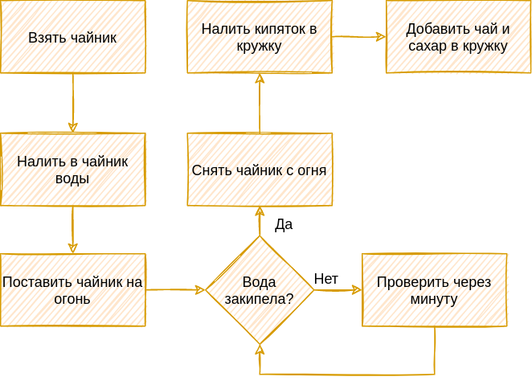

## Введение

`Python` - это высокоуровневый язык программирования, который используется в сферах разработки веб-приложений, машинного обучения, анализа данных, системном администрировании, создании скриптов, криптографии и тд. [[1]](https://skillbox.ru/media/code/dlya_chego_nuzhen_python/). Язык так же используется огромных количеством компаний, среди который `Google`, `Amazon`, `Facebook`, `Netflix`, `Spotify`, `Yandex` и многими другими [[2]](https://tceh.com/post/ne-webom-edinym/). Интересный факт: `Spotify` и `Instagram` полностью написанны на языке `Python`.

Язык ориентирован на повышение производительности разработчика и читаемости кода, благодаря чему завоевал огромную популярность среди языков программирования [[3]](https://dev.by/news/python-closer-to-top-3-in-tiobe-index). 

Не смотря на то, что язык был создан в `1991` году, он и по сей день поддерживается сообществом (в большинстве - добровольцев), которое занимается развитием и улучшением языка.

`Python` - довольно простой и понятный язык программирования который отлично подходит для начинающих. В отличии от многих других языков программирования.

К примеру, вот программа по выводу одной строки на экран:

```Python
print("Hello world!")
```

Тот же пример на языке `Java`:

```Java
public class Example {
  public static void main(String[] args) {
    System.out.println("Hello World!");
  }
}
```

И её аналог на языке  `C++`:

```c++
#include <iostream>

int main(int argc, char* argv[]) {
    std::stdout << "Hello world!" << std::endl;

    return 0;
}
```

Отличие явное, и это лишь простейшая программа.

Разумеется, что у языка есть свои недостатки и особенности, но об этом на ранних этапах лучше не задумываться.

## Основы программирования

И так, с языком мы определились, теперь, прежде чем начать изучения языка, необходимо немного разобраться в самом программировании.

Говоря простым языком, программирование - описание алгоритма с использованием языка программирования. В свою очередь, алгоритм - последовательность шагов для получения желаемого результата. В итоге и получается, что программирование, это всего лишь описание шагов для получения необходимого вам результата.

### Алгоритмы

Говоря об алгоритмах, мы сталкиваемся с ними каждый день. Практически, каждое наше действие является алгоритмом, который можно описать. Допустим, что бы сделать чай, нам необходимо:

1. Взять чайник
2. Налить в чайник достаточно воды
3. Поставить чайник на огонь
4. Дождаться, пока вода закипит
5. Снять чайник с огня
6. Налить кипяток из чайника в кружку
7. Добавить в кружку сахар и пакетик с чаем
8. Наслаждаться результатом

Для человека, который никогда не делал чай, сама по себе просьба `сделай чай` ни о чём не скажет, но если он увидит последовательность действий, то сразу станет понятно, что именно необходиом сделать.

По такому же принципу работает и компьюер. Это просто куча микросхем соединенных вместе. Он не сможет сделать чай, пока ему не объяснить ему, как именно это надо делать.

Вот пример описания алгоритма по готовке чая на языке программирования:

```Python
# Взять чайник
kettle = Kettle()
# Добавить 2 литра воды
kettle.add_water(liters=2)
# Включить нагревание чайника
kettle.turn_on_heating()

# Ждём до тех пор пока чайник не закипит
while kettle.is_boiled() is not True:
    wait()

# Выключаем нагревание чайника
kettle.turn_of_heating()

# Наливаем кипяток в кружку
cup = Cup(kettle)
# Добавляем 2 ложки сахара
cup.add_sugar(spoons=2)
# Добавляем чайный пакетик
cup.add_tea_bag()

print("Tea is done!")
```

Именно в таком виде (хоть и немного упрощённом) мы можем говорить компьютеру, что он должен сделать, что бы мы получили необходимый результат.

Существует так же визульаное представление алгоритмов (пример алгоритма выше):



Как видно, алгоритм довольно прост как в визуальном представлении, так и в представлении языка программирования.

Язык программирования - это инструмент общения и указания необходимых действий для компьютера. Наш мозг устроен таким образом, что когда мы хотим сделать чай, мы не особо задумываемся над шагами, необходимыми для этого, так как делали это уже сотни раз. Компьюеру же необходимо указать необходимые шаги для достижения результата.

### Память

После того, как мы добавили ложку сахара в чай, откуда мы знаем, что надо добавить ещё одну? Как мы можем быть уверенны, что одну ложку мы уже добавили?

Мы запонимаем эту информацию в процессе. Другими словами - мы храним в нашей памяти информацию о том, сколько ложек сахара мы уже добавили в чай и можем посчитать, сколько ещё осталось.

Так же работает и компьюетр. В процессе своей работы ему необходимо запоминать различную информацию.

Наша память работает ассоциациями, мы видим чай и помним, что уже добавили ложку сахара, смотрим на таблетки деда, и помним, что сегодня он не принимал их. Но память у компьюетера работает совершенно иначе, чем у людей. Компьютер не может мыслить или ассоциировать, он можешь лишь запоминать информацию и говорить нам, где она хранится. Например:

```Python
# Мой месячный бюджет
my_monthly_budget = 1.000

# Пил ли дед сегодня таблетки
did_old_man_drink_pills_today = False

# Имя моей собаки
my_dog_name = "Зверюга"
```

В таком виде мы говорим компьютеру: пожалуйста, запиши мой месячный бюджет `1.000` к себе в память, а обращаться к этому значению я буду с помощью имени `my_monthly_budget`. И когда я захочу посмотреть мой бюджет (или другую записанную информацию), достаточно просто попросить компьютер напечатать на экране это значение:

```Python
print(my_monthly_budget)
1.000
print(did_old_man_drink_pills_today)
False
print(my_dog_name)
"Зверюга"
```

## Ввод/вывод в программах

### Ввод

Сама по себе программа - последовательность шагов выполнения алгоритма. Однако, программа, которая всегда выполняется одинаково и не может взаимодействовать с конечным пользователем - не особо полезна. 

В качестве одного из способов взаимодействия программа может запросить какие-либо данные у пользователя. Например, программа, которая рассчитывает площадь стен комнаты:

```Python
a = input("Введите длину комнаты в метрах: ")
b = input("Введите ширину комнаты в метрах: ")
s = float(a) * float(b)

print("Площадь стен равна ", s, " м^2")
```

Встроенная функция `input` [[4]](https://younglinux.info/python/input) позволяет запросить у пользователя данные на вход программе и в результате возвращает строку, которую ввёл пользователь. Таким образом мы можем указывать различные данные на вход и получать рассчитанный результат на выходе. Согласитесь, это гораздо полезнее, чем каждый раз в ручную изменять числа в программе.

### Вывод

За вывод в языке отвечает встроенная функция `print` [[4]](https://younglinux.info/python/input). Данная функция идет лишь одну функцию - печать символов на устройство вывода (в нашем случае - на экран).

```Python
PI = 3.14

print("Пример вывода!")
print("Возможно так же подставить значение переменной в вывод: ", PI)
print(f"Можно подставить значение переменной {PI} прямо во внутрь строки")
print("Или же настроить количество знаков, которые отобразятся после запятой {PI:.1f}")
```

---

[1] [Сферы использование языка Python](https://skillbox.ru/media/code/dlya_chego_nuzhen_python/)

[2] [Компании использующие язык Python](https://tceh.com/post/ne-webom-edinym/)

[3] [Рейтинг языков программирования](https://dev.by/news/python-closer-to-top-3-in-tiobe-index)

[4] [Функция input](https://younglinux.info/python/input)
